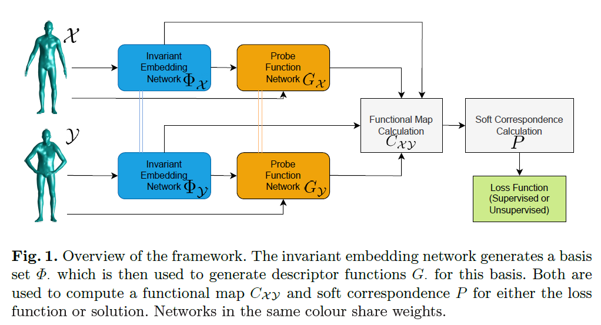
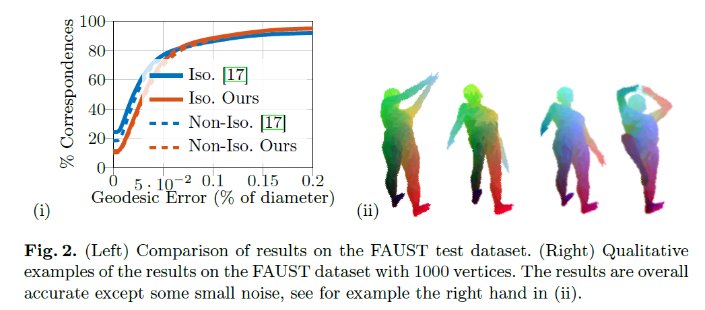

# A Network Analysis for Correspondence Learning via Linearly-Embedded Functions  

*Sharik Siddiqi, Zorah Lähner*  
[Read the paper here](10.1007/978-3-031-54605-1_7) (GCPR 2023) 🛡️ MIT License

 Learning Robust Functional Bases for Shape Correspondence: A deep dive into basis learning, robust training, and unsupervised extensions for non-rigid shape matching.

 ## Table of Contents
- [A Network Analysis for Correspondence Learning via Linearly-Embedded Functions](#a-network-analysis-for-correspondence-learning-via-linearly-embedded-functions)
  - [Table of Contents](#table-of-contents)
    - [Introduction](#introduction)
    - [Requirements](#requirements)
    - [Dataset Choice (Train/Test)](#dataset-choice-traintest)
    - [Proposed Setup](#proposed-setup)
    - [Training](#training)
    - [Evaluation](#evaluation)
  - [Final Products of the Script](#final-products-of-the-script)
    - [Results](#results)

### Introduction
 Calculating correspondences between non-rigidly deformed shapes is the backbone of many applications in 3D computer vision and
 graphics. The functional map approach offers an efficient solution to this problem and has been very popular in learning frameworks due to its
 low-dimensional and continuous nature. However, most methods rely on
 the eigenfunctions of the Laplace-Beltrami operator as a basis for the
 underlying function spaces. While these have many advantages, they
 are also sensitive to non-isometric deformations and noise. Recently a
 method to learn the basis functions along with suitable descriptors has
 been proposed by Marin et al.. We do an in-depth analysis of the architecture proposed, including a new training scheme to increase robustness
 against sampling inconsistencies and an extension to unsupervised train
ing which still obtains results on-par with the supervised approach.

For more details, refer to the [paper](#).

This repository provides a PyTorch implementation for learning correspondence between 3D shapes having undergone non-rigid deformations.

### Requirements

To install requirements:


To set up the environment and install dependencies:

1. Clone the repository:
    ```bash
    git clone https://github.com/sharik-siddiqi/shape_correspondence.git
    cd shape_correspondence
    ```

2. Install required dependencies:
      ```bash
      pip install -r requirements.txt

### Dataset Choice (Train/Test)

The dataset used for training and validation in this project consists of 1000 low-density meshes (with 1000 vertices) taken from the SURREAL dataset, which was generated using the SMPL model with various shape and pose parameters.

For testing, we use the registration of the FAUST dataset which contains 100 human shapes of 10 individuals in 10 poses each. In
 order to keep the problem size tractable, all shapes are downsampled to 1000 and 2100 vertices.

Due to the large size of the dataset, it is not included in the repository. If you wish to access the dataset, please contact me via the provided email.

### Proposed Setup
The *'model.py'* file contains the model architecture for both basis and descriptor models. These networks are realised through the *PointNet* architecture 



The pretrained model weights for both the basis model and the descriptor model are provided in this repository. You can use them directly without retraining the models from scratch.

The weights are located at:
```bash
./model/pretrained_weights/basis_model.pth
./model/pretrained_weights/desc_model.pth
```
### Training

Before running the `train_basis.py` and `train_desc.py`script, ensure the [path_guidlines](./code/README.md) are followed :

To train the basis model with any specific dataset (after making necessary changes), run these commands:

```train basis network
python .\code\train_basis.py
python .\code\train_desc.py
```

### Evaluation

To evaluate the model on the selected test dataset (FAUST), run:
```eval
python .\evaluation\evaluation_faust.py
```

## Final Products of the Script

1. **Geodesic Error Curves**:
   - **File**: `<path_to_save_curve_geo_error.mat>`
   - **Description**: This file contains the computed geodesic error curves and the corresponding thresholds.
   - **Contents**:
     - `mean_curves`: The mean geodesic error curves.
     - `thr`: The thresholds used for computing the error curves.
     - `geo_err_main`: The geodesic errors for all matches.
     - `match`: The `our_match_desc` values for all matches.

2. **Descriptor Values**:
   - **File**: `<path_to_save_descriptor_values.mat>`
   - **Description**: This file contains the computed descriptor values for all vertices in the processed shapes.
   - **Contents**:
     - `descriptors`: The descriptor values.

---

After getting the **Geodesic Error Curves** and **Descriptor Values** from the above matlab script, run the matlab scripts:

```eval
.\evaluation\plot_geodesic_error_curves.m
```

This script is used to compare the performance of **supervised** and **unsupervised** methods in terms of geodesic error (`Figure 2 (Left)`). The *mean geodesic errors, error curves, and area under curve (AUC)* values provide insights into how well the methods perform on shapes (isometric/non-isometric).

```eval
.\evaluation\visualise_performance.m
```

### Results

We report the results and some qualitative examples for our implementation against the supervised setup in Figure 2. 



Even though we do not use any ground-truth information, we were able to achieve results on-par with the supervised approach. The results of our implementations vs. the supervised setup in terms of mean error per vertex of the meshes in the test dataset are as follows:

| Model name | Ours   | Supervised |
| ---------- | ------ | ---------- |
| PyTorch    | 6.0e-2 | 6.78e-2    |

The idea and the code has driven it's inspiration from the below mentioned paper

```
@article{marin2020correspondence,
  title={Correspondence learning via linearly-invariant embedding},
  author={Marin, Riccardo and Rakotosaona, Marie-Julie and Melzi, Simone and Ovsjanikov, Maks},
  journal={Advances in Neural Information Processing Systems},
  volume={33},
  year={2020}
}
```